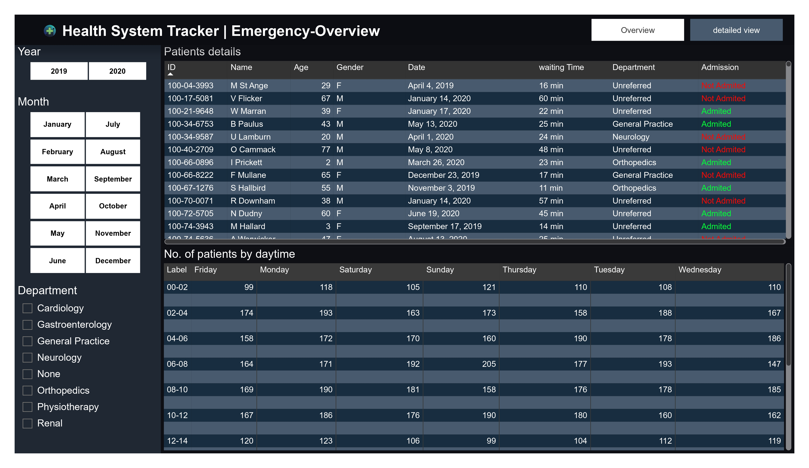
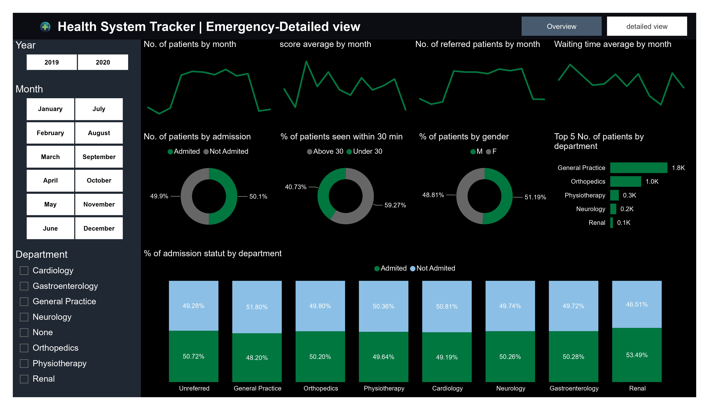

# Health System Emergency Analytics

Power BI dashboard for analyzing emergency department activity, patient flow, waiting times, admissions, and departmental performance.

## Project Overview

This project presents an interactive Power BI dashboard designed to analyze emergency department data and provide a clear overview of patient activity and operational performance.

The dashboard allows users to explore patient information, waiting times, admission status, department activity, and demographic distributions through interactive visualizations.

The project is organized into two main dashboard views:

- **Emergency Overview**
- **Emergency Detailed View**

## Business Objectives

The main objectives of this dashboard are to:

- Monitor emergency department activity.
- Analyze patient waiting times.
- Track admission status.
- Identify departments receiving the highest number of patients.
- Analyze patient distribution by gender.
- Monitor patients seen within 30 minutes.
- Compare department activity.
- Analyze emergency activity over time.

## Key Analysis Areas

### Patient Analysis

The dashboard provides insights into:

- Total number of patients.
- Patient distribution by gender.
- Patient admission status.
- Patient waiting times.
- Patients seen within 30 minutes.

### Department Analysis

The dashboard allows analysis of:

- Number of patients by department.
- Department activity.
- Departments receiving the highest number of patients.
- Distribution of patients across emergency departments.

### Waiting Time Analysis

Waiting time is analyzed to help understand emergency department efficiency and patient flow.

The dashboard also tracks patients who were seen within 30 minutes, providing an indicator of emergency service responsiveness.

### Time Analysis

The dashboard provides a temporal view of emergency activity, allowing users to analyze changes in patient volume and operational activity over time.

## Tools & Technologies

- **Microsoft Power BI**
- **Power Query**
- **DAX**
- **Data Modeling**
- **Data Visualization**

## Data Source

The emergency dataset is accessed by Power Query from a public CSV source hosted on GitHub.

The data is loaded and transformed inside Power BI before being used by the dashboard.

## Dashboard Preview

### Emergency Overview



### Emergency Detailed View



## Project Structure

```text
health-system-emergency-analytics/
│
├── PowerBI/
│   └── Health_System_Tracker.pbix
│
├── screenshots/
│   ├── Health_System_Tracker-1.jpg
│   └── Health_System_Tracker-2.jpg
│
├── Health_System_Tracker.pdf
│
└── README.md
```

## Key Insights

The dashboard makes it possible to analyze:

- Departments with the highest patient activity.
- Patient waiting-time patterns.
- Admission distribution.
- Patient demographic patterns.
- The proportion of patients seen within 30 minutes.
- Changes in emergency activity over time.

## Project Context

This project was developed as part of my practical work in Data Analytics using Microsoft Power BI.

## Author

**Abderrahman El Harakani**

**OutmanBAZ**

Master's Student in Data Science  
Data Analytics 

[LinkedIn](https://shorturl.at/nfMqM)
